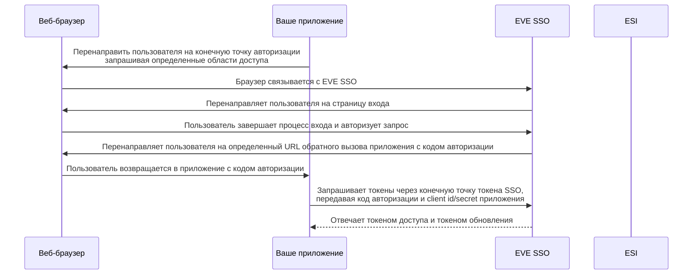
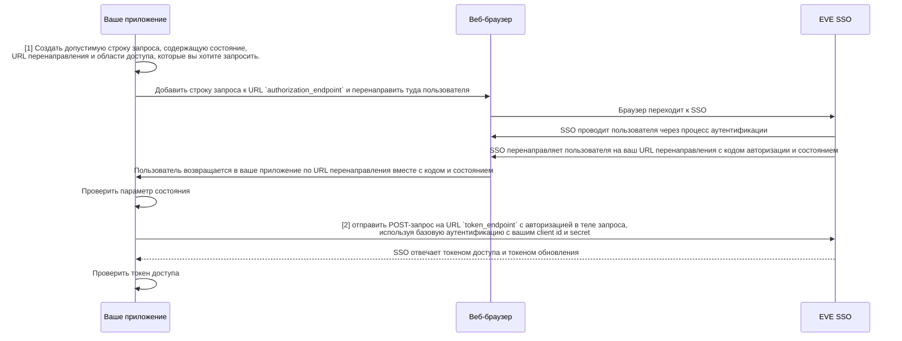
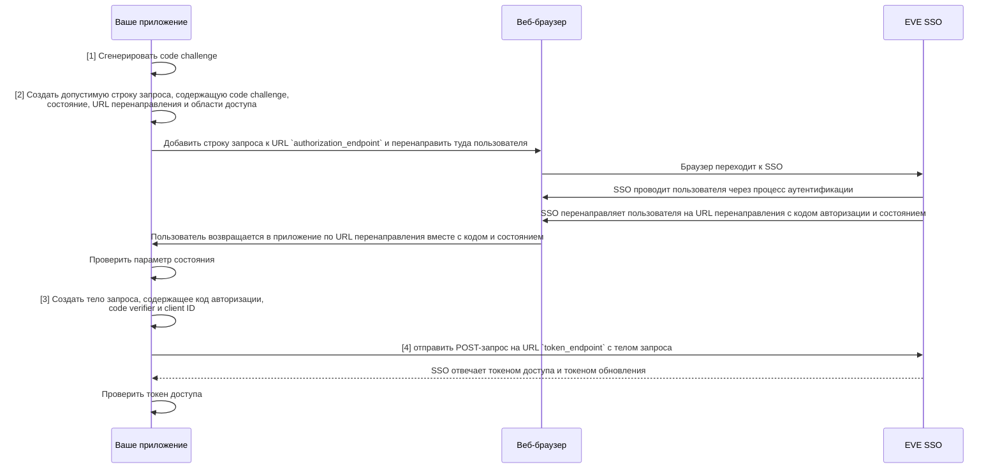

# Single Sign-On (SSO)

Сервис EVE Single Sign-On (SSO) помогает облегчить доступ сторонних приложений для игроков.
Используя протокол OAuth 2.0, EVE SSO позволяет игрокам входить на внешние веб-сайты, в приложения или инструменты, используя свои учетные данные EVE Online.
Кроме того, это обеспечивает безопасный способ для игроков авторизовать сторонние приложения для доступа к их данным EVE Online через API ESI без раскрытия учетных данных аккаунта.

SSO гарантирует, что сторонние приложения могут получить ограниченный доступ к данным персонажа на основе предоставленных разрешений (также известных как "scopes" - области доступа).
Например, стороннее приложение может запросить доступ к местоположению персонажа, очереди навыков или балансу кошелька, но только если игрок явно предоставит приложению разрешение на это.
В то же время области доступа, не предоставленные игроком, не будут доступны стороннему приложению.

Этот безопасный механизм контроля доступа на основе токенов гарантирует, что игроки имеют полный контроль над данными, которыми они делятся со сторонними приложениями, и могут отозвать доступ в любое время.

## Как это работает

Рабочий процесс EVE SSO основан на протоколе OAuth 2.0, который является широко используемым стандартом для безопасной авторизации.

Чтобы примерно объяснить рабочий процесс SSO, мы будем использовать пример стороннего веб-сайта, который хочет получить доступ к данным персонажа игрока.

1. **Регистрация приложения**: Перед использованием SSO разработчики должны зарегистрировать свое приложение на портале разработчиков EVE Online.
   Этот процесс генерирует уникальный client ID и secret, которые используются для аутентификации приложения в сервисе SSO.
2. **Запрос авторизации**: Когда пользователь хочет использовать стороннее приложение, приложение перенаправляет пользователя в сервис EVE SSO.
   Пользователю предлагается войти со своим аккаунтом EVE Online, после чего он выбирает, с каким персонажем продолжить, и подтверждает области доступа, которые будут предоставлены приложению. Пользователь должен явно дать согласие на все запрошенные области доступа или отменить процесс.
3. **Код авторизации и перенаправление**: Если пользователь выбрал персонажа и дал согласие на запрошенные области доступа, сервис SSO перенаправляет пользователя обратно в стороннее приложение.
   Перенаправление содержит код авторизации, который приложение может использовать для получения токена доступа.
4. **Обмен токенами**: Стороннее приложение отправляет код авторизации в сервис SSO вместе с client ID и secret. В ответ сервис SSO возвращает токен доступа вместе с токеном обновления.
   Токен доступа — это временный токен, используемый для аутентификации запросов к API ESI, в то время как токен обновления можно использовать для получения нового токена доступа, когда текущий истекает.
5. **Доступ к API ESI**: С токеном доступа стороннее приложение теперь может делать запросы к API ESI от имени пользователя. Токен действителен только для персонажа и областей доступа, на которые пользователь дал согласие, и до истечения срока его действия.

## Термины и важные примечания

- **Client ID и Secret**: Client ID и secret используются для аутентификации приложения в сервисе SSO.
   Client ID является публичным и может быть общедоступным, но secret должен храниться в секрете.
- **Области доступа (Scopes)**: Области доступа — это разрешения, которые пользователь должен предоставить приложению.
   Приложение может получить доступ только к данным, на которые пользователь дал согласие.
   Приложения также могут запрашивать только те области доступа, которые назначены им при регистрации приложения.
- **Токен доступа (Access Token)**: Токен доступа — это временный токен, который приложение использует для аутентификации запросов к API ESI.
   Токен действителен только для персонажа и областей доступа, на которые пользователь дал согласие.
- **Токен обновления (Refresh Token)**: Токен обновления используется для получения нового токена доступа, когда текущий истекает.
   Токен обновления долгоживущий и может использоваться для получения новых токенов доступа бесконечно, пока пользователь не отозвал доступ приложения.
   Этот токен должен храниться в безопасности, так как он может быть использован для получения новых токенов доступа.
- **Код авторизации (Authorization Code)**: Код авторизации — это одноразовый код, который приложение обменивает на токен доступа.
   Код действителен только в течение короткого периода и может быть использован только один раз.
- **URL перенаправления (Redirect URLs)**: Приложение должно определить URL перенаправления, куда отправляется пользователь после завершения процесса авторизации.
   URL перенаправления должен быть зарегистрирован с приложением. Любой другой URL будет отклонен сервисом SSO.
- **Параметр состояния (State Parameter)**: Параметр состояния используется для предотвращения CSRF-атак.
   Приложение генерирует случайную строку и включает её в запрос авторизации.
   Сервис SSO возвращает ту же строку в перенаправлении, и приложение должно проверить, что параметр состояния совпадает с отправленным.
- **Конечные точки (Endpoints)**: Сервис SSO имеет несколько конечных точек, с которыми взаимодействуют приложения. К ним относятся конечная точка авторизации, конечная точка токенов и конечная точка JWKS.
   URL-адреса этих конечных точек можно получить из известной конечной точки сервиса SSO: `https://login.eveonline.com/.well-known/oauth-authorization-server`.
   Эти URL могут измениться в будущем, поэтому рекомендуется всегда получать их из конечной точки, однако безопасно (и рекомендуется) кешировать их на разумное время.

## Потоки авторизации

!!! note "Перед началом"

    Если вы новичок в OAuth 2.0, мы рекомендуем прочитать [документацию OAuth 2.0](https://oauth.net/2/), чтобы лучше понять протокол.
    Также [раздел выше](#термины-и-важные-примечания) содержит информацию о том, как получить URL, необходимые для потоков авторизации.

Ниже приведены примеры некоторых различных потоков авторизации, которые можно использовать с сервисом EVE SSO. Это предполагает, что вы уже зарегистрировали свое приложение на портале разработчиков EVE Online и получили client ID и secret. Глядя на [обзор SSO](#как-это-работает), эти потоки в основном реализуют шаги 2, 3 и 4 рабочего процесса SSO.

### Authorization Code

Поток Authorization Code — это наиболее распространенный поток OAuth 2.0, используемый с сервисом EVE SSO. Он подходит для веб-приложений, которые могут безопасно хранить client secret на стороне сервера.

1. **Параметры запроса**: При перенаправлении пользователя в SSO вы передаете несколько параметров запроса, чтобы предоставить SSO информацию о том, какое приложение запрашивает доступ, какие области доступа запрашиваются и куда перенаправить пользователя после завершения процесса авторизации.   
   Все параметры запроса URL-кодируются и добавляются к URL `authorization_endpoint`.
      - `response_type=code`: Это сообщает SSO, что вы используете поток Authorization Code и ожидаете код авторизации в ответ.
      - `client_id=<your_client_id>`: Это client ID, который вы получили при регистрации приложения, и он идентифицирует ваше приложение при запросе входа. SSO использует его для поиска данных вашего приложения.
      - `redirect_uri=<your_redirect_uri>`: Это URL, на который пользователь будет перенаправлен после завершения процесса авторизации. Этот URL должен соответствовать одному из URL перенаправления, зарегистрированных с вашим приложением.
      - `scope=<space-separated list of scopes>`: Это список областей доступа, к которым ваше приложение запрашивает доступ. Пользователю будет предложено дать согласие на эти области доступа перед продолжением.
      - `state=<random_string>`: Это случайная строка, которую вы генерируете и включаете в параметры запроса. SSO вернет эту строку в URL перенаправления, и вы должны проверить, что она совпадает с отправленной, чтобы предотвратить CSRF-атаки.
   
2. **Запрос токена**: После получения кода авторизации приложение отправляет POST-запрос к конечной точке токенов со следующим телом, закодированным в формате form:
      - `grant_type=authorization_code`: Это сообщает SSO, что вы обмениваете код авторизации на токен доступа.
      - `code=<code>`: Это код авторизации, полученный от SSO.

      Запрос должен быть аутентифицирован с использованием базовой аутентификации с вашим client ID и secret.

<h4>Пример</h4>

--8<-- "snippets/sso/authorization-code.md"

### Authorization Code с PKCE

Поток Authorization Code с PKCE (Proof Key for Code Exchange) — это улучшенная версия потока Authorization Code. Он в основном предназначен для мобильных и настольных приложений, которые не могут безопасно хранить client secret.

1. **Code Challenge**: Приложение генерирует code challenge, который является хешированной версией code verifier.  
   Code verifier — это случайная строка, которую приложение генерирует и держит в секрете.  
   Code challenge отправляется в SSO в запросе авторизации, в то время как code verifier используется в запросе токена.

2. **Параметры запроса**: При перенаправлении пользователя в SSO вы передаете несколько параметров запроса, чтобы предоставить SSO информацию о том, какое приложение запрашивает доступ, какие области доступа запрашиваются и куда перенаправить пользователя после завершения процесса авторизации.   
   Все параметры запроса URL-кодируются и добавляются к URL `authorization_endpoint`.
      - `code_challenge=<code challenge>`: Это code challenge, сгенерированный приложением.
      - `code_challenge_method=S256`: Это сообщает SSO, что code challenge хеширован с использованием алгоритма SHA-256.
      - `response_type=code`: Это сообщает SSO, что вы используете поток Authorization Code и ожидаете код авторизации в ответ.
      - `client_id=<your_client_id>`: Это client ID, который вы получили при регистрации приложения, и он идентифицирует ваше приложение при запросе входа. SSO использует его для поиска данных вашего приложения.
      - `redirect_uri=<your_redirect_uri>`: Это URL, на который пользователь будет перенаправлен после завершения процесса авторизации. Этот URL должен соответствовать одному из URL перенаправления, зарегистрированных с вашим приложением.
      - `scope=<space-separated list of scopes>`: Это список областей доступа, к которым ваше приложение запрашивает доступ. Пользователю будет предложено дать согласие на эти области доступа перед продолжением.
      - `state=<random_string>`: Это случайная строка, которую вы генерируете и включаете в параметры запроса. SSO вернет эту строку в URL перенаправления, и вы должны проверить, что она совпадает с отправленной, чтобы предотвратить CSRF-атаки.

3. **Тело кода**: Тело, отправляемое на конечную точку токенов, представляет собой тело, закодированное в формате form, содержащее следующие параметры:
      - `grant_type=authorization_code`: Это сообщает SSO, что вы обмениваете код авторизации на токен доступа.
      - `code=<code>`: Это код авторизации, полученный от SSO.
      - `code_verifier=<code verifier>`: Это code verifier, который использовался для генерации code challenge.
      - `client_id=<your_client_id>`: Это client ID, который вы получили при регистрации приложения, и он идентифицирует ваше приложение при запросе входа. SSO использует его для поиска данных вашего приложения.

**Создание code challenge**: Code challenge генерируется путем хеширования code verifier с использованием алгоритма SHA-256 и последующего кодирования результата в base64url. Code verifier — это случайная строка, которую приложение генерирует и держит в секрете.

Чтобы создать code verifier, вы генерируете 32 случайных байта данных и кодируете их в base64 url. Сохраните этот verifier, так как он понадобится позже для обмена кода авторизации на токен доступа.

Чтобы создать code challenge, хешируйте code verifier с использованием алгоритма SHA-256, а затем закодируйте результат в base64 url. Это code challenge, который вы отправляете в SSO в запросе авторизации. Согласно [RFC 4648](https://tools.ietf.org/html/rfc4648#section-5), кодирование base64 url должно выполняться без заполнения (т.е. замените завершающие символы `=` на ничего).

<h4>Пример</h4>

--8<-- "snippets/sso/authorization-code-pkce.md"

## Проверка JWT-токенов

После получения токена доступа от EVE SSO вы можете использовать его для аутентификации запросов к ESI. Токен доступа — это JWT (JSON Web Token), который содержит информацию о пользователе и предоставленных областях доступа. Если вы хотите убедиться, что токен действителен и выдан EVE SSO, вам нужно проверить подпись, проверить время истечения срока действия и убедиться, что токен предназначен для вашего приложения.

<h3>Проверка подписи</h3>

Токен доступа — это JWT, который подписан EVE SSO с использованием ключа RSA. Чтобы проверить подпись, вам нужно получить публичный ключ из конечной точки JWKS (JSON Web Key Set) SSO и использовать его для валидации токена.

Сервис SSO имеет [конечную точку метаданных](https://login.eveonline.com/.well-known/oauth-authorization-server), которая предоставляет URL конечной точки JWKS. Если вы хотите проверить подпись токена доступа, обязательно сначала получите информацию о метаданных, а затем получите публичный ключ из конечной точки JWKS. Хотя конечная точка JWKS вряд ли изменится, она не гарантированно статична, поэтому рекомендуется получать её из конечной точки метаданных каждый раз, когда она вам нужна.

<h3>Проверка издателя</h3>

Утверждение `iss` в JWT-токене должно соответствовать URL издателя сервиса SSO. Это URL, которым был выдан токен, и должен быть `https://login.eveonline.com/`. В некоторых случаях `login.eveonline.com` может использоваться в качестве издателя, поэтому рекомендуется проверять оба и отклонять токены, которые не совпадают.

<h3>Аудитория</h3>

Утверждение `aud` в JWT-токене — это аудитория токена. Это должен быть массив с одним значением, являющимся `client_id` вашего приложения, и другим статическим значением `"EVE Online"`. Вы должны проверить, что утверждение `aud` содержит оба этих значения, и отклонить токены, которые не совпадают.

<h3>Время истечения срока действия</h3>

Утверждение `exp` в JWT-токене — это время истечения срока действия токена, представленное как временная метка Unix. Вы должны проверить это утверждение, чтобы убедиться, что срок действия токена не истек. Если срок действия токена истек, вы должны запросить новый токен, используя токен обновления. Большинство библиотек, совместимых с `jose`, автоматически проверят время истечения срока действия за вас и имеют дополнительную настройку для допустимого периода отсрочки.

<h4>Пример</h4>

--8<-- "snippets/sso/validate-jwt-token.md"

## Утверждения JWT-токена

Теперь, когда вы проверили JWT-токен, вы можете использовать утверждения, принадлежащие токену, чтобы получить больше информации о доступе токена и для кого он был выдан.

Утверждение `sub` в JWT-токене имеет формат `EVE:CHARACTER:<character-id>` и может использоваться для получения ID текущего персонажа. Утверждение `name` содержит имя персонажа, а утверждение `scp` — массив областей доступа, предоставленных этому токену.

## Кнопки "Войти через EVE Online"

При создании кнопки для направления пользователей на вход на ваш сайт или в приложение с помощью EVE SSO, пожалуйста, используйте одно из следующих изображений для кнопки. Это помогает создать согласованность для игроков EVE среди всех сторонних приложений при просмотре вашего сайта или приложения.

